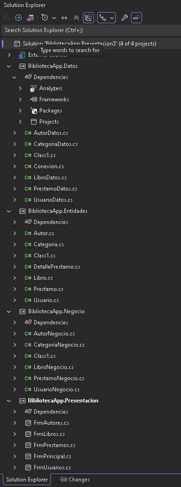
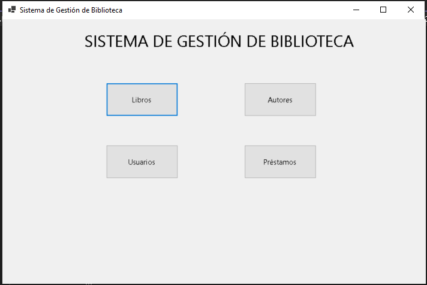
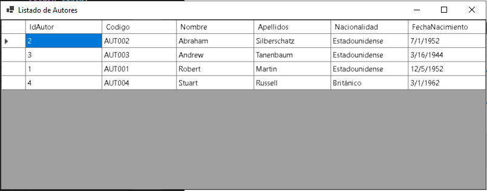
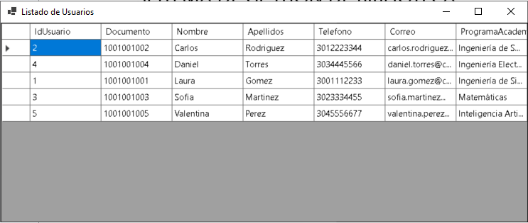
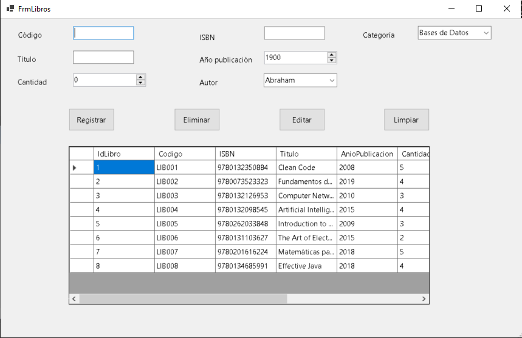
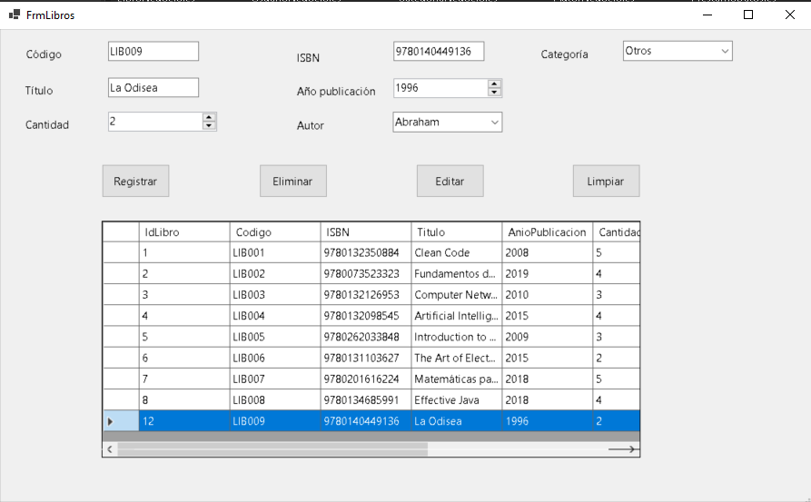
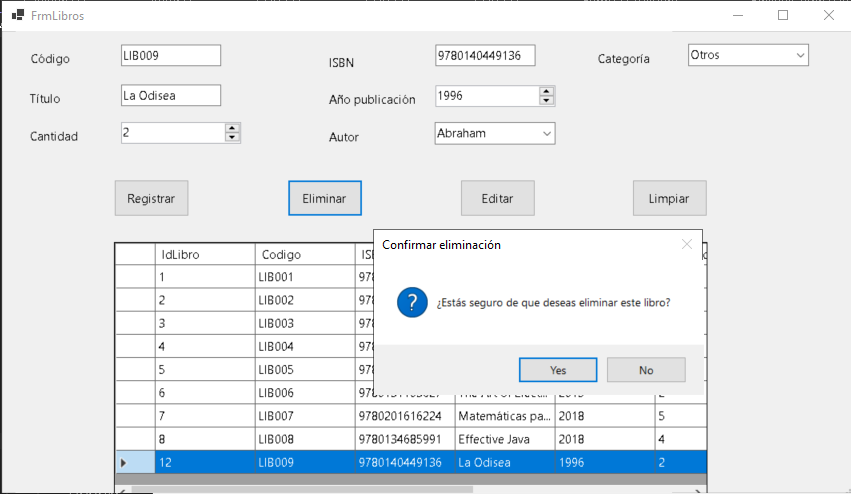
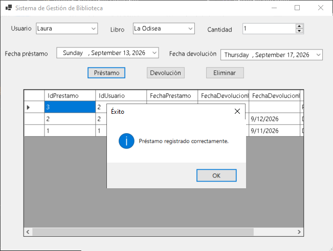
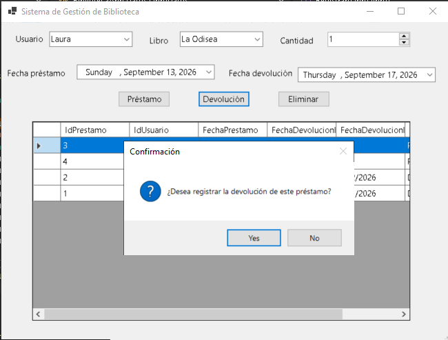
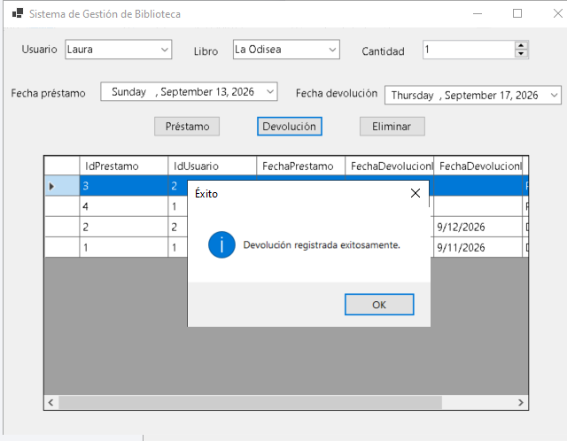

<!-- PORTADA -->
<div align="center">

# SISTEMA DE GESTIÓN DE BIBLIOTECA
### Proyecto Final - Programación Avanzada

**Presentado por:** Elisa Alcantara 
**Asignatura:** Programación Avanzada  
**Institución:** Institución Universitaria  
**Fecha:** Septiembre de 2026  

</div>

<div page-break-before="always"></div>

<!-- CONTRAPORTADA -->
<div align="center">

# SISTEMA DE GESTIÓN DE BIBLIOTECA
### Documentación Técnica y Arquitectura de Software

Documento presentado como evidencia de la implementación del proyecto final de la asignatura Programación Avanzada, estructurado bajo el patrón de arquitectura N-Capas, orientado a objetos y persistido en SQL Server.

**Ciudad y País:** Tunja, Colombia  
**Año:** 2026  

</div>

<div page-break-before="always"></div>

---

## TABLA DE CONTENIDO
1. [Introducción](#1-introducción)
2. [Objetivos](#objetivos)
   - 2.1 [Objetivo General](#21-objetivo-general)
   - 2.2 [Objetivos Específicos](#22-objetivos-específicos)
3. [Planteamiento del Problema](#3-planteamiento-del-problema)
4. [Análisis de Requerimientos](#4-análisis-de-requerimientos)
   - 4.1 [Requerimientos Funcionales](#41-requerimientos-funcionales)
   - 4.2 [Requerimientos No Funcionales](#42-requerimientos-no-funcionales)
5. [Modelado del Sistema](#5-modelado-del-sistema)
   - 5.1 [Casos de Uso](#51-casos-de-uso)
   - 5.2 [Diagrama de Clases (C# POO)](#52-diagrama-de-clases-c-poo)
   - 5.3 [Modelo Entidad-Relación (SQL Server)](#53-modelo-entidad-relación-sql-server)
   - 5.4 [Diccionario de Datos](#54-diccionario-de-datos)
6. [Arquitectura del Sistema](#6-arquitectura-del-sistema)
7. [Explicación de Módulos Desarrollados](#7-explicación-de-módulos-desarrollados)
8. [Pruebas de Funcionamiento y Capturas de Pantalla](#8-pruebas-de-funcionamiento-y-capturas-de-pantalla)
9. [Conclusiones](#9-conclusiones)
10. [Recomendaciones](#10-recomendaciones)
11. [Referencias Bibliográficas (Normas APA)](#11-referencias-bibliográficas-normas-apa)

---

## 1. INTRODUCCIÓN
La administración eficiente de recursos bibliográficos en instituciones educativas requiere sistemas de información que automaticen la trazabilidad de los libros y el ciclo de vida de los préstamos. El presente documento detalla la arquitectura, el diseño de base de datos y la implementación del **Sistema de Gestión de Biblioteca**, desarrollado en C# Windows Forms bajo el enfoque de Programación Orientada a Objetos (POO) en una arquitectura en N-Capas con persistencia en Microsoft SQL Server.

---

## OBJETIVOS

### 2.1 Objetivo General
Desarrollar una aplicación de escritorio robusta mediante C# y SQL Server que automatice la gestión de catálogo, autores, usuarios, préstamos y devoluciones de una biblioteca institucional.

### 2.2 Objetivos Específicos
- Aplicar los principios de la Programación Orientada a Objetos (Encapsulamiento, Abstracción, Modularidad).
- Diseñar e implementar una base de datos relacional con integridad referencial en SQL Server.
- Implementar una arquitectura por capas (`Presentacion`, `Negocio`, `Datos`, `Entidades`) para garantizar el desacoplamiento.
- Garantizar la validación de datos en tiempo de ejecución y un manejo adecuado de excepciones.
- Utilizar Git y GitHub como sistema de control de versiones y documentación.

---

## 3. PLANTEAMIENTO DEL PROBLEMA
La institución educativa registraba de forma manual sus procesos de inventario bibliográfico y control de préstamos. Esta metodología provocaba inconsistencias en los datos, pérdida de registros de usuarios morosos, falta de visibilidad en el stock en tiempo real y lentitud operativa al realizar consultas o devoluciones.

---

## 4. ANÁLISIS DE REQUERIMIENTOS

### 4.1 Requerimientos Funcionales
- **RF01. Gestión de Libros:** CRUD completo de catálogo, asignación de ISBN único, stock y vinculación con Autores/Categorías.
- **RF02. Gestión de Autores:** Registro y consulta de autores (Código, Nombre, Apellidos, Nacionalidad, Fecha Nacimiento).
- **RF03. Gestión de Categorías:** Clasificación por áreas temáticas (Programación, Redes, BD, etc.).
- **RF04. Gestión de Usuarios:** Registro de miembros habilitados (Documento, Nombre, Teléfono, Correo, Programa).
- **RF05. Gestión de Préstamos:** Registro de salida de libros, control de existencias en tiempo real y asignación de estado (`Prestado`).
- **RF06. Gestión de Devoluciones:** Procesamiento de retorno de libros, actualización de stock y cambio de estado a `Devuelto`.

### 4.2 Requerimientos No Funcionales
- Interfaz gráfica amigable e intuitiva desarrollada en Windows Forms.
- Validación de campos obligatorios y formato de correo/teléfono.
- Mensajes claros al usuario ante confirmaciones o errores (`MessageBox`).
- Arquitectura desacoplada en N-Capas.

---

## 5. MODELADO DEL SISTEMA

### 5.1 Casos de Uso
- **UC01 - Gestionar Libros:** El administrador registra, actualiza o elimina ejemplares del catálogo.
- **UC02 - Registrar Préstamo:** El sistema valida disponibilidad de stock y existencia del usuario antes de crear el préstamo.
- **UC03 - Procesar Devolución:** Se selecciona el préstamo activo de la grilla y se actualiza el estado y el inventario.

### 5.2 Diagrama de Clases (C# POO)
```
+-------------------+        +-------------------+
|      Autor        |        |       Libro       |
+-------------------+        +-------------------+
| + IdAutor: int    |        | + IdLibro: int    |
| + Codigo: string  |        | + Codigo: string  |
| + Nombre: string  | <----- | + Titulo: string  |
| + Apellidos: string| 1   * | + Cantidad: int   |
+-------------------+        | + IdAutor: int    |
                             +-------------------+
                                       ^
                                       | 1
                                       | *
                             +-------------------+
                             |     Prestamo      |
                             +-------------------+
                             | + IdPrestamo: int |
                             | + IdLibro: int    |
                             | + IdUsuario: int  |
                             | + Estado: string  |
                             +-------------------+
```
### 5.3 Modelo Entidad-Relación (SQL Server)
Autor (1) -> Libro (N)

Usuario (1) -> Prestamo (N)

Libro (1) -> Prestamo (N)

### 5.4 Diccionario de Datos

Campo,Tipo,Nulo,Descripción / Regla

IdPrestamo,"INT (PK, IDENTITY)",NO,Identificador único del préstamo.

IdUsuario,INT (FK),NO,Llave foránea hacia la tabla Usuario.

IdLibro,INT (FK),NO,Llave foránea hacia la tabla Libro.

FechaPrestamo,DATETIME,NO,Fecha de salida (Por defecto GETDATE()).

FechaDevolucion,DATETIME,SÍ,Fecha efectiva de retorno.

Estado,VARCHAR(20),NO,Estado del préstamo (Prestado / Devuelto).


 6. ARQUITECTURA DEL SISTEMA
El proyecto implementa una arquitectura en 4 Capas desacopladas:

BibliotecaApp.Presentacion: Formularios WinForms (FrmPrincipal, FrmLibros, FrmPrestamos, FrmAutores, FrmUsuarios).

BibliotecaApp.Negocio: Lógica de aplicación y reglas de validación (PrestamoNegocio, LibroNegocio, AutorNegocio).

BibliotecaApp.Datos: Acceso a la base de datos SQL Server mediante comandos ADO.NET (Conexion.cs, PrestamoDatos.cs).

BibliotecaApp.Entidades: Clases DTO que encapsulan los datos del dominio (Autor, Libro, Usuario, Prestamo).

 7. EXPLICACIÓN DE MÓDULOS DESARROLLADOS
Módulo Principal (FrmPrincipal.cs)
Panel de navegación modal que conecta los sub-módulos del sistema evitando la duplicación de instancias mediante ShowDialog().

Módulo de Préstamos y Devoluciones (FrmPrestamos.cs)
Permite registrar préstamos y realizar devoluciones seleccionando filas directamente desde el DataGridView. La clave primaria se captura de forma segura en el evento CellClick:
```
private void dgvPrestamos_CellClick(object sender, DataGridViewCellEventArgs e)
{
    if (e.RowIndex >= 0)
    {
        DataGridViewRow fila = dgvPrestamos.Rows[e.RowIndex];
        if (fila.Cells[0].Value != null)
        {
            idPrestamoSeleccionado = Convert.ToInt32(fila.Cells[0].Value);
        }
    }
}
```
## 8. PRUEBAS DE FUNCIONAMIENTO Y CAPTURAS DE PANTALLA

### Arquitectura y Estructura del Proyecto


### Módulo Principal


### Gestión de Autores


### Gestión de Usuarios


### Gestión de Libros




### Gestión de Préstamos y Devoluciones




9. CONCLUSIONES
Se logró la construcción de un sistema de gestión de biblioteca escalable gracias a la separación de responsabilidades que ofrece la arquitectura N-Capas.

La gestión de devoluciones y captura dinámica de identificadores en controles DataGridView mejoró sensiblemente la experiencia de usuario y redujo los errores de ejecución.

La integración entre C# WinForms y SQL Server proporcionó una persitencia segura de la información del dominio.

10. RECOMENDACIONES
Implementar controles de paginación en el DataGridView para optimizar el rendimiento ante grandes volúmenes de registros.

Incorporar un módulo de autenticación con roles de usuario (Administrador, Bibliotecario, Estudiante).

11. REFERENCIAS BIBLIOGRÁFICAS (NORMAS APA)
Microsoft. (2026). Documentación de Windows Forms y .NET Framework. Microsoft Learn. https://learn.microsoft.com/es-es/dotnet/desktop/winforms/

Skeet, J. (2019). C# in Depth (4th ed.). Manning Publications.
